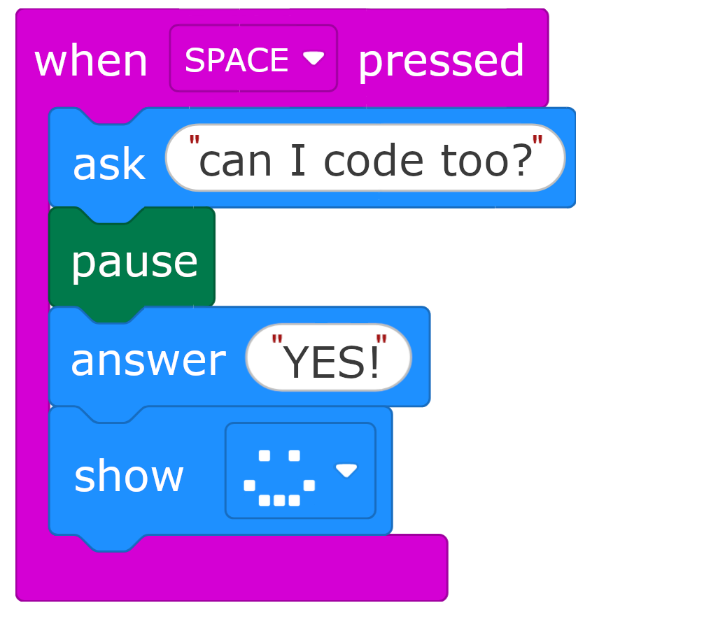

I've just been filling in a project evaluation form for my project funded by [The Blockly Accessibility Fund] and wanted to take the chance to reflect and share what I've been working on. 

In this project, I wanted to open up block-based coding (think Scratch, MakeCode, etc) to young people with disabilities who use eye gaze to control their computer. The funding from Google.org has given me a chance to focus on meeting individuals, seeing where they are at, and building tools to give them access to an essential part of the curriculum. 

## Why this matters

Learning to code is part of learning how computers work, and how you can make them work for you. We want all students to understand how to control and shape the tools they use, not just to be passive consumers. I often argue that some of the people who have the most to gain from digital literacy and confidence are those who use assistive technology to give them more access to communication, studies, work, and many aspects of their lives. I want those individuals to have the skills and knowledge to build, steer or demand better assistive technology for themselves and their peers. 

## The people

I worked with 10 young people over the course of the project. They ranged from driven young adults studying computer science and related subjects in higher and further education, who had learned to code the hard way, all the way to children in a specialist primary school who had never been exposed to any kind of coding at all.

*Among them: a young girl who thought coding was for boys. A teenager who wants to learn to code to make millions, and a young adult who got into coding by building mods for her favourite games.*

I'm grateful to every one of them, and to those who facilitated, for working with me on what was sometimes a very early prototype, and for sharing their enthusiasm. Our sessions were adapted to each person's setup and access needs, and varied depending on what stage the project was at - sometimes testing a new idea, or validating lessons learned from previous sessions. Thanks also to [Melanie] for bringing her AAC expertise and warmth to many of the user testing sessions. 

## Eye gaze for computer access

Some people with physical disabilities can't use a keyboard, mouse, touch screen, or other standard ways to control a computer. But often, even when other motor control is limited, eye control is good - this is common, for example, with cerebral palsy. 

An eye tracker is a small device with cameras that attaches to your monitor and plugs into your computer. It works out where you are looking on the screen, and a piece of software uses this to control an interface. 

In practice, this usually means looking at a large target on the screen to a set amount of time until it registers as a "click". Many people first encounter eye gaze through communication: an AAC (Augmentative and Alternative Communication) device where you look at a symbol to say a word, or at letters to build a sentence.

With more experience, some people move onto directly controlling a mouse pointer - you look at a point on screen, hold your gaze there, and it clicks. This opens up access to many more things on a computer, but it is harder, requiring good oculomotor control, lots of practice, and a good eye tracker. 

## Different user groups

In user testing we found that 3 main groups of users emerged, with quite different access needs:

### Grid-based users

Some children have not yet acquired the skills or experience to directly control a mouse, and need to use a grid-based system where the only requirement is to hold your gaze on large targets. We can give these students a grid-based interface that sends keyboard commands to a coding interface - this was only made possible by the work of [Blockly] and [The Micro:bit Foundation] to add keyboard controls to the micro:bit MakeCode editor. Now that more coding platforms such as [Code.org] are adding keyboard controls, the options here will improve further. 

We built interfaces for these users, allowing them to independently complete micro:bit coding activities using exactly the same micro:bit MakeCode Editor that a non-disabled peer might use (embedded within a grid-based interface to give them controls). 

[IMAGE - LINKs TO VIDEO intro]

However, one of the big challenges seen here was how all the layers of cognitive challenge added up - they have far more to learn than someone using standard controls
- The concept of coding itself: writing instructions and having a computer follow them
- The context: we're writing software for this small piece of hardware (a micro:bit) that can light up and make sounds 
- What we're actually trying to achieve with a given activity
- A new grid-based interface with buttons, labels and sub-pages to learn
- The MakeCode editor's navigation, accessed through those grid buttons: when to press enter vs escape vs back, how to navigate a nested toolbox, how dialogues work

With me there to support, it was possible to focus on the learning objective and learn the layers of access as we went along - together proving to the adults around them that they can meaningfully engage with the learning goals. I could add or gradually remove support, to help them achieve what they were picturing, but also test how useable my solution was. 

But a more realistic scenario would be a teacher who isn't themselves confident with coding, isn't confident with the MakeCode editor, and isn't familiar with the grid interface I've provided, trying this with a child whose cognitive ability to engage they're unsure of. That's a lot of barriers stacked up, and all of them obscuring the opportunity for the student to show their competence. 

Even in mainstream settings, I've spoken to schools who have acquired a box of micro:bits which then languish in a cupboard for years until there was a teacher confident enough to open the box (spoiler: as soon as they've taught 1 lesson they realise it's super easy with all the micro:bit teaching resources). We know from the DofE's report [Developing a competency framework for effective assistive technology training] by [Rohan Slaughter] and [Tom Griffiths] that basic IT skills are often a barrier in specialist schools and colleges, which significantly impacts the ability to use AT (assistive technology) to support learners. 

To better tackle this barrier, I am working on a new [accessible coding introductory curriculum] designed specifically for eye gaze or switch access without cursor control, alternative single-click cursor control (eye gaze / touch / head mouse / switch-based gliding cursor) and many other assistive tech setups. We're both minimising the access barriers in the coding interface, and scaffolding activities that get you used to it step-by-step. If this interest you, [sign up here to be involved].

[Screenshot - links to video]

### Expert cursor users

Users who are comfortable with "direct pointer control" (i.e. using a mouse with their eyes) could already access mainstream platforms like the micro:bit MakeCode editor well and only needed a couple of pointers to help them get stuck in. This was a hugely positive finding. 

[IMAGE - links to video]

### Intermediate cursor users

Several students reported being comfortable with direct pointer control, but their eye gaze system's accuracy made pointer control error-prone and frustrating. However, this way of controlling an interface is so much more direct than using keyboard controls that they were not interested in an alternative - they would persist with great patience, but using up a lot of cognitive effort on using the interface, not leaving much space for the learning goals. 

One specific challenge here was dragging blocks around the screen. How well dragging works is very variable: it depends on how smart your eye gaze software is, your calibration, accuracy, and experience. Some users got on fine with most of the dragging, but others found it frequently went wrong, and it was hard to recover. 

These intermediate or early cursor users would benefit significantly from starting with a simpler environment which requires less dragging, and is more forgiving. Although they can learn to use the more open-ended mainstream platforms, building confidence and familiarity in a simpler environment will help a lot, as well as giving them a chance to prove to those around them that they can do this. This is why the new [introductory accessible coding curriculum] we are building will focus on being accessible with direct pointer control as well as grid-based control. 

## What's next

My goals going forward are two-fold:

1. Build tools that work as a more accessible first coding experience, as a stepping stone towards the mainstream platforms. Make sure students can try coding without juggling several layers of new information and access barriers. 
2. Show the supporting adults that coding *can* be accessible, and is an important part of the curriculum for their students. Show the students that people like them can do this. 

I am now working with [Loreto] and [Chris] on a new [accessible coding curriculum] design for eye gaze, switch access, and many other assistive tech setups. It scaffolds activities step by step, minimises the access barriers in the coding interface, and with direct pointer control, never requires a drag. Just click on a block to insert it, and rearrange blocks by clicking on connections. 

The goal is to provide a first coding environment where access challenges are minimised. Let a student build familiarity with coding concepts in a simpler environment, so they're not learning everything at once. The scaffolded steps and simple environment make it easy enough for a teacher to pick up, so they aren't afraid to give it a go and see what their students are capable of. 

We're planning to trial this with a number of schools this year. If this interests you, [sign up here to be involved].

[Screenshot - links to video]

AI disclaimer: This post is approximately 95% human. Claude was used to pull out core ideas from my initial brainstorm, and provide final editing advice. 
