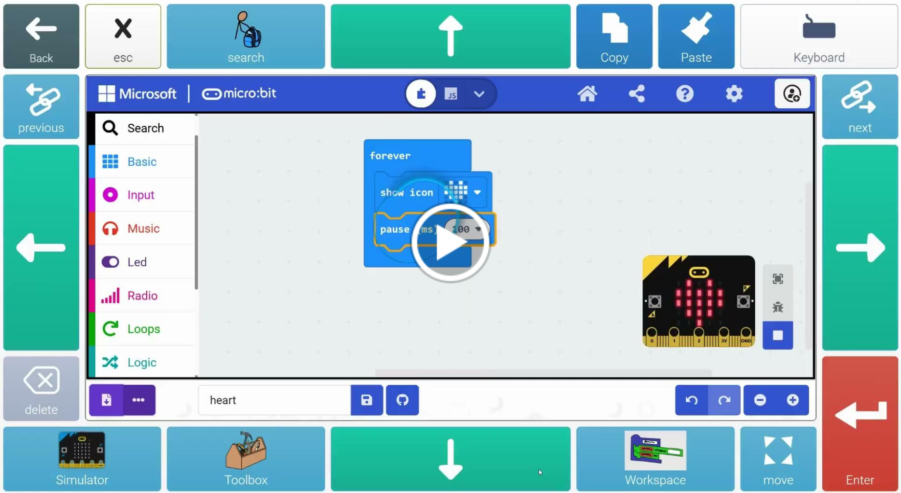
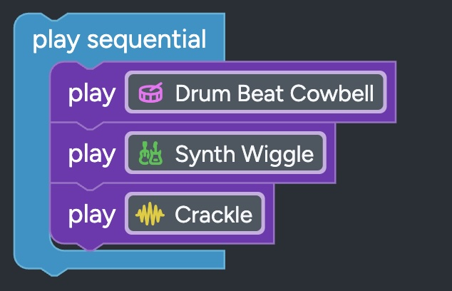

[← Back to Block Coding](../)

## Resources for grid-based access

If your student uses eye gaze with grid selection, switch scanning, or other grid-based methods, these resources provide keyboard navigation interfaces for block coding platforms.

## How it works

We've built grid interfaces that let students code without needing any cursor control. Everything works through grid cells and keyboard commands - no mouse cursor needed.

These were initially designed for eye gaze access, but they could work for any other access method including switch. Get in touch if you want to help us create new versions to suit specific access needs. 

    
    
<em>Click to watch: Grid-based block coding in action</em>

## Platform limitations

Grid-based control needs keyboard navigation, which is currently only available in micro:bit MakeCode. We're working on developing support for Code.org Music Lab, and Blockly Games. Neither Scratch nor other MakeCode platforms have keyboard navigation yet, but we expect them to adopt it in the next year or so. 

## MakeCode grid interface

**Status: Ready to Use**

We've developed Grid 3 interfaces for the micro:bit MakeCode editor. This was possible because MakeCode was the first Blockly-based platform to add comprehensive keyboard navigation controls.

### What's included

- **Standard grid**: 7 rows × 11 columns layout
- **Compact grid**: 5 rows × 8 columns for users who need fewer cells
- Full keyboard navigation for all coding tasks
- No cursor control required

### Features

    <h4 style="margin-top: 0;">Navigate the interface</h4>
    <ul>
        <li>Move between toolbox, workspace, and menus</li>
        <li>Select and place blocks</li>
        <li>Connect blocks together</li>
        <li>Delete and modify blocks</li>
        <li>Run and test your code</li>
    </ul>

    <h4 style="margin-top: 0;">Customizable layout</h4>
    <ul>
        <li>Choose grid size that works for your student</li>
        <li>Adjust cell size and spacing</li>
        <li>Compatible with eye gaze and switch scanning</li>
        <li>Works with Grid 3 access software</li>
    </ul>

### Download and setup

    
<strong>Ready to get started?</strong>

    
Contact us to receive download links and setup instructions for Grid 3:

    <ul>
        <li><a href="mailto:kirsty.mcnaught@gmail.com">Email for direct download</a></li>
        <li><a href="https://docs.google.com/forms/d/e/1FAIpQLScUwZBrLn7O6XstouOKBpPTYDqz-kaxeoqoJMx4yrz-rHLksg/viewform">Request via registration form</a></li>
    </ul>
    
We provide full setup support and can adapt the interface to your specific access method.

## Beginner grid interface

    

We're working with Code.org's Music Lab to create a simpler environment, more suitable for beginners and those with higher access needs.

### Why Music Lab?

- Simplified block coding interface
- Immediate audio feedback (engaging for all students)
- Fun, creative projects
- Less complex than micro:bit programming

### What we're building

- Grid 3 interface adapted for Music Lab
- Larger, simpler grid layouts
- Suitable for younger students and beginners
- Can be adapted to other access software beyond Grid 3

    
<strong>Want to test the Music Lab interface?</strong>

    
We're seeking testers for this beginner-friendly environment. <a href="mailto:kirsty.mcnaught@gmail.com">Contact us</a> or <a href="https://docs.google.com/forms/d/e/1FAIpQLScUwZBrLn7O6XstouOKBpPTYDqz-kaxeoqoJMx4yrz-rHLksg/viewform">fill in our registration form</a> for early access.

## User testing opportunities

We're running 1.5 hour online testing sessions. Participants receive:

- £50 Amazon voucher
- Step-by-step guidance during the session
- Flexible scheduling
- Follow-up support
- Early access to new interfaces

Adult/guardian must be present for participants under 18.

[Register your interest →](https://docs.google.com/forms/d/e/1FAIpQLScUwZBrLn7O6XstouOKBpPTYDqz-kaxeoqoJMx4yrz-rHLksg/viewform)

## Frequently asked questions

**Will this work for switch users?**
Yes, the grid interfaces work for switch scanning as well as eye gaze. The keyboard navigation means any access method that can activate grid cells will work.

**Do you only support Grid 3?**
No, Grid 3 is what our initial testers used. We can adapt to whatever setup you have - contact us to discuss your specific access method.

**What if my student uses a different AAC/access software?**
We can work with you to adapt the interface. The underlying keyboard commands work with any software that can send keyboard input.

**Can my student become a professional developer?**
Possibly! Software development is an accessible career since it doesn't matter how you operate your computer. New AI coding tools are making it even more accessible. But you don't need career ambitions to enjoy block coding - there are lots of fun projects for everyone.

## Questions or feedback?

We want to hear about your experiences using grid-based access for coding.

- [Email us](mailto:kirsty.mcnaught@gmail.com) with questions or feedback
- [Register for user testing](https://docs.google.com/forms/d/e/1FAIpQLScUwZBrLn7O6XstouOKBpPTYDqz-kaxeoqoJMx4yrz-rHLksg/viewform) sessions
- Share what's working and what could be better

[← Back to Block Coding](../)
