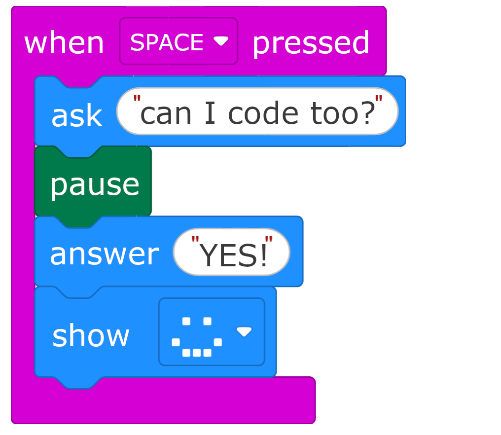
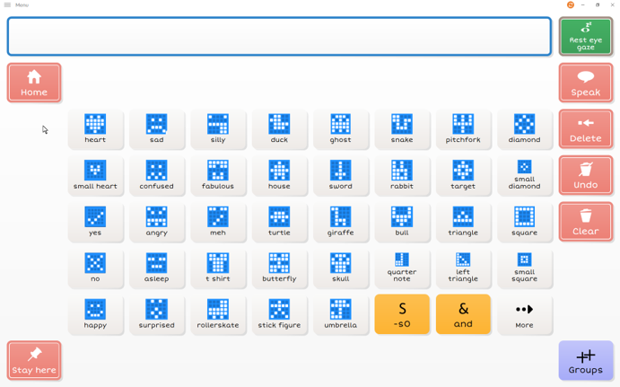

    

## Making block coding accessible for everyone

Many children first learn to code at school using block coding platforms like Scratch, Code.org or MakeCode. These are designed to be easy to use, but the "drag and drop" method can be challenging for students who use eye gaze, switch access or other alternative inputs for computer control.

This project is funded by the [Blockly Accessibility Fund](https://developers.google.com/blockly/accessibility-fund). There are two ways we can help: building a purpose-built environment that removes access barriers from the start, or providing resources and tips for accessing mainstream platforms.

## Starting from basics

<strong>We have built a new introductory coding curriculum</strong> designed specifically for students who use eye gaze, switch access, or other assistive technology. Unlike existing platforms, this environment is built from the ground up to minimise access barriers — no dragging required, simpler navigation, and scaffolded step-by-step activities that a teacher can pick up confidently.

It is designed to be a first coding experience: a place to build familiarity with coding concepts before moving on to more open-ended platforms. We are planning trials with schools this year and would love to hear from you.

<a href="/blockly-motor-access/" class="bc-cta">Find out more and try the maze game</a>

<a href="https://zeroday.camp/volunteers-needed-accessible-cs-curriculum-testers/">Sign up to be involved in trials</a>

## Accessing mainstream platforms

We've organised resources for three key groups. Your student may match more than one!

    <article class="card">
        
        

            <h3>Grid-based access users</h3>
            
<strong>For students using:</strong> eye gaze with grid selection, switch scanning, or other grid-based methods.

            
If your student requires grid-based access rather than direct pointing, we have designed interfaces in Grid 3 that use keyboard controls to access the micro:bit MakeCode editor.

            <a href="grid-based-access" class="card-link">View grid-based access resources</a>
        

    </article>
    
    <article class="card">
        
        

            <h3>Mouse control users</h3>
            
<strong>For students using:</strong> eye gaze for cursor control, joystick, head pointer, or similar devices.

            
If your student can use direct pointer control (moving a cursor), we recommend starting there. We have tips, tricks and user videos to help make block coding easier.

            <a href="direct-cursor-control" class="card-link">View direct cursor control resources</a>
        

    </article>

    <article class="card">
        
        

            <h3>AAC users</h3>
            
<strong>For students who:</strong> use communication devices and want coding vocabulary support

            
Having access to relevant vocabulary is essential when learning a new topic. Our AAC pages help students to discuss and explain their code using their AAC device. This can also be used to dictate coding where direct access to the coding tools is not possible.

            <a href="aac-support" class="card-link">View AAC support resources</a>
        

    </article>

## Understanding the platforms

Different block coding platforms (Scratch, MakeCode, Code.org) all use the same underlying technology, an engine called [Blockly](https://developers.google.com/blockly) which was built by Google. This means that any improvements to core accessibility can help with many different platforms. However, some platforms are further ahead in integrating recent accessibility advances.

**Grid-based control:** Grid-based control requires keyboard navigation. This is currently available in micro:bit MakeCode but is not yet available in other mainstream platforms.

**Mouse-based control:** Although we have started by focussing with micro:bit MakeCode, the resources supporting mouse-based control will be relevant to most platforms, including Scratch and Code.org.

## Why this matters

Programming opens doors to STEM careers and helps students think about problems in new ways. Understanding how computers, games and apps work empowers students to modify and build software for their own needs.

Many assistive tools are built by people who don't fully understand what life is like for assistive tech users. We want to help students join the community of builders and create better assistive technology - or make their own projects: games, apps, home automation or anything they can imagine.

## Get involved

If you're a teacher, therapist, parent, or researcher working with students who use alternative access methods, we'd love to hear from you.

- [Email us](mailto:kirsty.mcnaught@gmail.com) to share feedback or ask questions
- [Fill in our registration form](https://docs.google.com/forms/d/e/1FAIpQLScUwZBrLn7O6XstouOKBpPTYDqz-kaxeoqoJMx4yrz-rHLksg/viewform) to participate in user testing sessions

---

## Quick links

- [Resources for Direct Cursor Control](direct-cursor-control)
- [Resources for Grid-Based Access](grid-based-access)
- [AAC Communication Support](aac-support)
